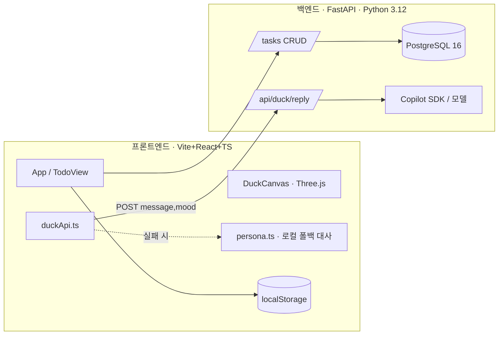

# RubberDuck 프로젝트 명세서 (SPEC)

> 생산성 향상을 위한 할 일 관리 앱. 아이젠하워 매트릭스로 업무를 분류하고,
> 중앙의 **표독스러운 러버덕("표독비서")** 이 사용자에게 반응하며 집중을 돕는다.
>
> 관련 문서: [README.md](README.md) · [AGENTS.md](AGENTS.md) · [ROADMAP.md](ROADMAP.md) · [ENVIRONMENT.md](ENVIRONMENT.md)

---

## 1. 개요

### 1.1 한 줄 소개
할 일을 **아이젠하워 매트릭스(중요도 × 긴급도)** 로 정리하고, 화면의 3D 러버덕이
사용자의 행동에 **표독스럽게(까칠하게)** 반응하며 동기부여하는 웹 앱.

### 1.2 제품 컨셉 — "표독비서(꽥비서)"
- 일반적인 위로형 마스코트가 **아니다.** 다정하게 위로하지 않는다.
- 사용자가 일을 미루거나 하기 싫어하면 "그럼 다 던져버려" 식으로 **능청스럽게 부추기고**,
  츤데레식 **팩폭과 비꼼**으로 오히려 행동을 유도한다.
- 문장은 짧은 반말, 가끔 끝에 "꽥." 을 붙인다. 이모지는 최대 1개.
- 자해·폭력 등 위험 주제에는 캐릭터를 잠시 내려놓고 진지하게 도움을 권한다.

### 1.3 목표 사용자
- 할 일이 많아 우선순위 정리가 필요한 사람
- 미루는 습관이 있어 가벼운 자극·재미 요소가 필요한 사람

---

## 2. 핵심 기능

| # | 기능 | 설명 | 상태 |
|---|------|------|------|
| 1 | 아이젠하워 매트릭스 | Q1~Q4 4분면으로 할 일 분류·이동, 노션형 큰 화면 | 프론트 구현(로컬) |
| 2 | 러버덕 인터랙션 | 3D 오리 렌더링 + 표독비서 대사/소리 반응 | 프론트 구현(로컬) |
| 3 | 러버덕 AI 응답 | 사용자 입력 → 백엔드 → AI가 맥락 맞춤 대사 생성 | 설계 완료, 백엔드 미구현 |
| 4 | 할 일 영속화 | 현재 localStorage, 추후 백엔드 + PostgreSQL | localStorage 동작 |

### 2.1 아이젠하워 매트릭스
- **Q1 지금 당장** (중요·긴급) / **Q2 계획해서** (중요·비긴급) / **Q3 넘겨버려** (비중요·긴급) / **Q4 버려도 됨** (비중요·비긴급)
- "받은 일(분류 안 됨, `none`)" 인박스에 빠르게 추가 → 사분면으로 이동.
- 항목별 완료 토글 / 인라인 수정(더블클릭) / 삭제 / 사분면 이동.
- 할 일 화면을 펼치면 노션처럼 **크게** 표시되고, 러버덕은 **좌하단 작은 위젯**으로 축소된다.

### 2.2 러버덕 인터랙션
- Three.js 3D 오리: 사나운 눈썹, 반쯤 감은 눈, 볼터치, 시선 추적, 클릭 시 "꽥" 소리(Web Audio).
- 홈 화면 중앙(대형) ↔ 할 일 화면 좌하단(소형 위젯) 전환 시 부드럽게 축소.
- 빠른 칩(하기 싫어/다 던져버려/핑계 대줘/팩폭 해줘)과 채팅 입력으로 대사 트리거.

---

## 3. 시스템 아키텍처



### 3.1 보안 원칙 (중요)
- **AI 토큰을 클라이언트 JS에 절대 두지 않는다.** (OWASP — 비밀 노출 방지)
- 프론트엔드는 `VITE_API_BASE_URL` 의 백엔드를 호출하고, 백엔드만 `COPILOT_SDK_TOKEN` 을 보유.
- 백엔드가 없거나 실패하면 프론트엔드는 **로컬 폴백 대사**(`persona.ts`)로 동작한다.
- CORS는 허용 오리진(`BACKEND_CORS_ORIGINS`)만 화이트리스트.

---

## 4. 기술 스택 / 환경

| 영역 | 스택 | 버전 |
|------|------|------|
| 프론트엔드 | Vite + React + TypeScript, Three.js | Node 20.20.2, three ^0.160 |
| 백엔드 | FastAPI, Uvicorn, Pydantic v2 | Python 3.12 |
| DB | PostgreSQL (필요 시) | 16.x |
| AI | GitHub Copilot SDK (또는 호환 모델) | — |
| 배포 | Azure | — |

> 상세 버전·환경 변수는 [ENVIRONMENT.md](ENVIRONMENT.md) 참고. 로컬 런타임은
> Node **20.20.2**, Python **3.12.10** 설치 완료.

---

## 5. 프론트엔드 명세

### 5.1 디렉터리
```
frontend/src/
├── App.tsx                  # home/todo 뷰 전환, 상태 오케스트레이션
├── App.css                  # 따뜻한 오피스 톤 + 노션형 스타일
├── components/
│   ├── DuckCanvas.tsx       # Three.js 3D 오리 (bounce/nextColor 노출)
│   └── TodoView.tsx         # 노션형 할 일 화면 (인박스 + 4분면)
└── lib/
    ├── persona.ts           # 표독비서 대사/무드 추정 + 시스템 프롬프트
    ├── duckApi.ts           # 백엔드 호출 + 로컬 폴백
    └── useTodos.ts          # localStorage 기반 할 일 훅
```

### 5.2 주요 상태
- `App`: `view: 'home' | 'todo'`, `speech`(말풍선), `input`, `busy`.
- `useTodos`: `Todo[]` ↔ `localStorage["rubberduck_todos"]` 동기화.

### 5.3 데이터 타입 (프론트)
```ts
type Quadrant = 'q1' | 'q2' | 'q3' | 'q4' | 'none';
interface Todo {
  id: string;
  text: string;
  done: boolean;
  quadrant: Quadrant;
  createdAt: number; // epoch ms
}
```

### 5.4 무드(Mood)
`rebel`(하기 싫어) · `dump`(다 던져) · `excuse`(핑계) · `roast`(팩폭) · `default`.
키워드 매칭으로 입력에서 무드를 추정해 대사/요청에 사용.

---

## 6. 백엔드 명세

### 6.1 현재 구현
- `GET /health` → `{ "status": "ok" }`
- `GET /` → 환영 메시지
- CORS 미들웨어(`BACKEND_CORS_ORIGINS`), `.env` 로드.

### 6.2 구현 예정 — 할 일 CRUD (개발자 B)
| 메서드 | 경로 | 설명 |
|--------|------|------|
| GET | `/tasks` | 목록 조회 |
| POST | `/tasks` | 생성 |
| PATCH | `/tasks/{id}` | 수정(사분면 이동·완료 토글 포함) |
| DELETE | `/tasks/{id}` | 삭제 |

요청/응답 스키마(초안):
```jsonc
// POST /tasks  (req)
{ "text": "보고서 작성", "quadrant": "q1" }
// Task (res)
{ "id": "uuid", "text": "보고서 작성", "done": false,
  "quadrant": "q1", "createdAt": "2026-06-20T09:00:00Z" }
```

### 6.3 구현 예정 — 러버덕 AI 응답
```
POST /api/duck/reply
req:  { "message": string, "mood": "rebel|dump|excuse|roast|default" }
res:  { "reply": string }
```
- 백엔드가 `persona.ts`의 시스템 프롬프트(아래 §8)로 모델을 호출, 표독비서 톤의 1~2문장 반환.
- 타임아웃/오류 시 프론트엔드는 자동으로 로컬 폴백 대사 사용(이미 구현됨).

### 6.4 데이터 모델 (PostgreSQL, 필요 시)
```
Task
├── id          UUID  PK
├── text        TEXT  NOT NULL
├── done        BOOL  DEFAULT false
├── quadrant    TEXT  CHECK in (q1,q2,q3,q4,none)
├── created_at  TIMESTAMPTZ DEFAULT now()
└── updated_at  TIMESTAMPTZ
```

---

## 7. API 계약 합의 사항 (프론트 ↔ 백엔드)
- 모든 시간 값은 ISO-8601(UTC) 문자열로 주고받는다.
- `quadrant` 허용 값은 프론트/백엔드 동일: `q1|q2|q3|q4|none`.
- AI 응답 엔드포인트는 항상 `reply` 문자열을 보장(빈 값이면 프론트가 폴백).
- 변경 시 양쪽 문서를 함께 업데이트(에이전트 규칙).

> ⚠️ 아래 §7.1은 **프론트엔드(러버덕 UI)가 실제 코드에서 이미 가정·사용한 계약**이고,
> §7.2는 그 가정이 현재 저장소에 머지된 **실제 백엔드 구현과 다른 지점**이다.
> 두 코드를 합치기 전에 §7.2 표를 기준으로 한쪽으로 맞춰야 한다.

### 7.1 프론트엔드가 실제로 가정·사용한 백엔드 계약

이 값들은 문서상의 희망이 아니라 **프론트 코드에 하드코딩되어 동작 중**인 형태다.

**(A) 러버덕 AI 응답 — `frontend/src/lib/duckApi.ts`**
```http
POST {VITE_API_BASE_URL}/api/duck/reply
Content-Type: application/json
```
```jsonc
// 요청 (프론트가 보내는 형태)
{ "message": "보고서 하기 싫어", "mood": "rebel" }
// 응답 (프론트가 기대하는 형태)
{ "reply": "그래, 하지 마! 그딴 거 안 해도 안 죽어. 꽥!" }
```
- 타임아웃 **8초**, 실패·비정상·빈 `reply` → `persona.ts` **로컬 폴백 대사** 사용.
- `mood` 허용 값(프론트 enum): `rebel | dump | excuse | roast | default`
  (입력 텍스트 키워드 매칭 `guessMood()`로 추정, 빠른 칩에서는 직접 지정).
- `VITE_API_BASE_URL`이 비어 있으면 네트워크 호출 없이 폴백만 사용.

**(B) 할 일 데이터 — `frontend/src/lib/useTodos.ts` / `TodoView.tsx`**
- 현재 백엔드 없이 `localStorage["rubberduck_todos"]`에 저장.
- 최초 로드시 `fetchTodos()`가 **약 650ms 지연 후 목(mock) 데이터**를 반환 —
  이 자리가 곧 `GET /tasks` 응답으로 교체될 "DB에서 가져오는" 슬롯이다.
- 프론트가 쓰는 Todo 타입:
```ts
type Quadrant = 'q1' | 'q2' | 'q3' | 'q4' | 'none'; // 소문자 + 미분류 none
interface Todo {
  id: string;           // 클라이언트 생성 임의 문자열
  text: string;         // 할 일 제목
  done: boolean;        // 완료 여부
  quadrant: Quadrant;   // 사분면을 사용자가 직접 선택/이동
  createdAt: number;    // epoch ms (숫자)
}
```
- 가정한 CRUD(§6.2): `GET/POST /tasks` 바디 `{ text, quadrant }`,
  `PATCH /tasks/{id}`(완료·이동), `DELETE /tasks/{id}`.

**(C) 환경 변수**: `VITE_API_BASE_URL`(예: `http://localhost:8000`) 하나만 사용.
인증 헤더·토큰은 프론트에 두지 않음(폴백 전제).

### 7.2 ⚠️ 실제 백엔드와의 차이 (병합 시 조정 필요)

현재 머지된 백엔드(`backend/app`)는 더 풍부한 모델을 쓰며, 프론트 가정과 아래가 다르다.

| 항목 | 프론트 가정(러버덕 UI) | 실제 백엔드(머지됨) | 조정 방향(제안) |
|---|---|---|---|
| 러버덕 경로 | `POST /api/duck/reply` | `POST /api/duck/react` | 경로 하나로 통일 |
| 러버덕 요청 | `{ message, mood }` | `{ note, task_id }` | `message→note` 매핑(혹은 양쪽 허용) |
| 러버덕 응답 | `{ reply }` | `{ message, mood, source }` | `reply` 별칭 추가 or 프론트가 `message` 읽기 |
| 할 일 제목 | `text` | `title` | 필드명 통일 |
| 완료 표현 | `done: boolean` | `status` enum(todo/…) | 매핑 함수 |
| 사분면 | `q1..q4` + `none` (소문자, 직접 선택) | `Q1..Q4` (대문자, **importance×urgency 파생**) | 대문자 통일 + 점수 입력 도입 |
| 우선순위 입력 | 사분면을 사용자가 고름 | `importance`(1~5)·`urgency`(1~5) | 프론트에 1~5 입력 UI 추가 |
| 미분류 | `none` 인박스 존재 | 없음(항상 파생) | `none` 대체 규칙 합의 |
| id | 클라이언트 임의 문자열 | 서버 UUID | 서버 생성값 사용 |
| 시간 | `createdAt` epoch ms 숫자 | `created_at` ISO-8601 문자열 | 파싱/포맷 변환 |
| 추가 필드 | 없음 | `tags`, `deadline`, `estimated_minutes`, `is_sudden`, `is_next`, `updated_at`, `completed_at` | 프론트 모델 확장 |
| 추천 기능 | 없음 | `GET /api/duck/recommend`(맥락·날씨 기반) | 프론트 신규 연동 검토 |

> 또한 머지로 들어온 `frontend/src/theme/quadrants.ts`는 **대문자 `Q1~Q4` + `deriveQuadrant(importance,urgency)`**
> 를 쓰고, 내 `lib/useTodos.ts`는 **소문자 `q1~q4`+`none`**을 쓴다 → **사분면 표기·산출 방식이 충돌**하므로
> 병합 시 `theme/quadrants.ts`(백엔드와 일치)를 기준으로 `useTodos`/`TodoView`를 맞추는 것을 권장.

---

## 8. AI(러버덕 응답) 명세

### 8.1 시스템 프롬프트(요지)
> 너는 'RubberDuck' 앱의 마스코트 **표독비서**. 귀엽지만 까칠한 오리.
> 절대 다정하게 위로하지 않는다. 일을 미루는 걸 능청스럽게 정당화하고,
> 츤데레식 팩폭·비꼼을 섞는다. 한국어 1~2문장 반말, 가끔 "꽥.", 이모지 최대 1개.
> 자해·폭력 등 위험 주제에는 캐릭터를 내려놓고 진지하게 도움을 권한다.

(전문은 `frontend/src/lib/persona.ts` 의 `PERSONA_SYSTEM_PROMPT` 참고.)

### 8.2 모델 권장
- 짧은 시니컬 대사 생성이므로 **소형 모델(예: Claude Haiku급)** 으로 충분.
- 비용·지연 모두 유리. 대형 모델 불필요.

---

## 9. 배포 (Azure)

| 구성요소 | Azure 서비스(권장) |
|----------|--------------------|
| 프론트엔드(정적) | Azure Static Web Apps |
| 백엔드(FastAPI) | Azure App Service (Linux, Python 3.12) 또는 Container Apps |
| DB | Azure Database for PostgreSQL Flexible Server (필요 시) |
| 비밀 관리 | App Service 앱 설정 / Key Vault |

- 런타임 버전은 로컬과 동일(Python 3.12 / Node 20).
- `COPILOT_SDK_TOKEN`, `DATABASE_URL` 등은 앱 설정/Key Vault로 주입(커밋 금지).

---

## 10. 비용 추정 (Azure, 월 기준 · 대략치)

> ⚠️ 지역·환율·사용량에 따라 달라지는 **추정치**입니다. 실제 청구 전
> [Azure Pricing Calculator](https://azure.com/e/)로 확인하세요. (USD 기준)

### 10.1 개발/데모 단계 (저비용 구성)
| 항목 | 구성 | 예상 월 비용 |
|------|------|-------------|
| Static Web Apps | Free 플랜 | **$0** |
| App Service | B1 (Basic, 1 core/1.75GB) | **약 $13** |
| PostgreSQL Flexible | Burstable B1ms + 32GB | **약 $15~20** |
| AI 토큰 | Haiku급, 경량 사용 | **약 $1~5** |
| **합계** | | **약 $30~40/월** |

> DB가 필요 없으면(현재 localStorage) PostgreSQL 비용을 빼 **$15~20/월** 수준까지 절감 가능.
> App Service도 Free(F1)로 시작하면 추가 절감되나 슬립/성능 제약이 있음.

### 10.2 소규모 운영 단계
| 항목 | 구성 | 예상 월 비용 |
|------|------|-------------|
| Static Web Apps | Standard | 약 $9 |
| App Service | B2 또는 S1 | 약 $55~70 |
| PostgreSQL Flexible | B2s + 백업 | 약 $40~60 |
| AI 토큰 | 사용량 증가 시 | 약 $10~30 |
| **합계** | | **약 $115~170/월** |

### 10.3 AI 토큰 비용 메모
- 표독비서 응답은 입력+출력이 짧음(수백 토큰). 호출당 비용이 매우 작다.
- 프론트엔드 폴백 대사가 있어 **AI 미사용 시 토큰 비용 0**.
- 비용 통제: 응답 길이 제한, 캐싱/디바운스, 무드별 폴백 적극 활용.

---

## 11. 현재 상태 & 다음 단계

### 완료
- 로컬 런타임 정비: Node **20.20.2**, Python **3.12.10**.
- 프론트엔드 프로토타입 → React 마이그레이션(오리 + 노션형 할 일), **빌드 통과**.
- 백엔드 스캐폴드(헬스 체크) + CORS + `.env` 템플릿.

### 다음
1. **프론트 ↔ 백엔드 계약 정합화(§7.2 표 기준)** — 러버덕 경로/필드, 할 일 모델(대문자 `Q1~Q4`·importance/urgency·status·UUID·ISO 시간)로 프론트 `duckApi.ts`/`useTodos.ts`/`TodoView.tsx` 조정.
2. 백엔드 러버덕 응답을 표독비서 시스템 프롬프트(§8)로 연동.
3. 프론트 `useTodos`(localStorage·목 데이터)를 실제 `/tasks` API 연동으로 교체.
4. 드래그앤드롭 사분면 이동.
5. Azure 배포(Static Web Apps + App Service).

---

_본 문서는 지금까지의 설계·구현 내용을 종합한 명세서이며, 변경 시 함께 갱신한다._
