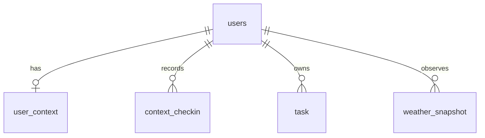

# RubberDuck 설계 문서 (DB 스키마 + API)

생산성 향상 앱 RubberDuck의 데이터 모델, 데이터베이스 스키마, REST API 설계를 정의합니다.

> 관련 문서: [AGENTS.md](../AGENTS.md) · [ROADMAP.md](../ROADMAP.md) · [ENVIRONMENT.md](../ENVIRONMENT.md)

---

## 1. 개념 요약

- 할 일(Task)을 **중요도(importance) × 급함(urgency)** 두 축으로 4분할 매트릭스에 배치한다.
- 배치/우선순위 판단을 돕기 위해 사용자 **맥락(context)** 을 입력으로 사용한다.
  - **고정값(UserContext)**: 직업·출퇴근·체력 등 거의 변하지 않는 정보
  - **변화값(ContextCheckIn)**: 기분·에너지 등 켤 때마다 기록되는 시계열
  - 가정: **고정값은 변화값에 영향을 줄 수 있다.**
- 앱을 언제·얼마나 자주 켤지 모르므로 변화값은 **덮어쓰지 않고 시점(timestamp)을 가진 기록으로 누적**해 추세를 계산한다.

---

## 2. 엔티티 & 값 형태

### users (소유자) — MVP에서는 단일 사용자로 시작 가능
| 필드 | 타입 | 비고 |
|------|------|------|
| id | UUID (PK) | |
| created_at | timestamptz | |

### user_context (고정값)
| 필드 | 타입 | 값 형태 |
|------|------|---------|
| id | UUID (PK) | |
| user_id | UUID (FK→users) | |
| job | text | 선택지(사무직/현장직/교대/학생/프리랜서/기타) + 자유텍스트 |
| commute_status | enum | `remote` / `office` / `hybrid` |
| base_stamina | smallint | 1~5 척도 |
| recent_issues | text | 짧은 자유텍스트 |
| chronotype | enum | `morning` / `neutral` / `evening` |
| priority_values | text | 자유텍스트(장기 목표/가치) |
| work_life_ratio | smallint | 0~100 (업무 비중 %) |
| updated_at | timestamptz | 고정값 조정 시각 |
| created_at | timestamptz | |

### context_checkin (변화값, 시계열)
| 필드 | 타입 | 값 형태 |
|------|------|---------|
| id | UUID (PK) | |
| user_id | UUID (FK→users) | |
| recorded_at | timestamptz | 켠 시각(같은 날 여러 건 허용) |
| mood | smallint | 1~5 척도 |
| energy_level | smallint | 1~5 척도 |
| sleep_hours | numeric(3,1) | 시간(숫자) |
| sleep_quality | smallint | 1~5 척도 |
| available_minutes | int | 오늘 가용 시간(분) |
| created_at | timestamptz | |

### task (할 일)
| 필드 | 타입 | 값 형태 |
|------|------|---------|
| id | UUID (PK) | |
| user_id | UUID (FK→users) | |
| title | text | |
| importance | smallint | 1~5 척도 |
| urgency | smallint | 1~5 척도 |
| deadline | timestamptz NULL | 급함 축 핵심 신호 |
| is_sudden | boolean | "갑자기 추가된 일" 플래그 |
| is_next | boolean | "다음에 할 일" 표시 |
| estimated_minutes | int NULL | 예상 소요 시간(분) — 가용 시간 적합도 계산에 사용 |
| tags | text[] | 세부 구분 태그 id 목록 (4.6 참고) |
| status | enum | `todo` / `doing` / `done` |
| created_at | timestamptz | |
| updated_at | timestamptz | |
| completed_at | timestamptz NULL | 완료 추세 분석용 |

> **사분면(quadrant)** 은 저장하지 않고 importance·urgency로 파생한다.
> 경계 예시(임계값 3): `importance>=3 & urgency>=3 → Q1`, `importance>=3 & urgency<3 → Q2`,
> `importance<3 & urgency>=3 → Q3`, `importance<3 & urgency<3 → Q4`.

### weather_snapshot (외부 날씨, 시계열)
외부 날씨 API(Open-Meteo, 키리스 무료)에서 가져온 기온·습도·상태를 누적한다.
변화값 체크인과 같은 "시계열 신호"로, 추천 점수와 추세 분석에 함께 사용한다.

| 필드 | 타입 | 값 형태 |
|------|------|---------|
| id | UUID (PK) | |
| user_id | UUID (FK→users) | |
| recorded_at | timestamptz | 관측 시각 |
| latitude | numeric(7,4) NULL | 위도 |
| longitude | numeric(7,4) NULL | 경도 |
| temperature_c | numeric(4,1) NULL | 기온(℃) |
| humidity_pct | smallint NULL | 상대습도(%) |
| condition | text NULL | 날씨 상태(맑음/비/눈 등, 한글) |
| source | text NULL | 출처(`open-meteo` / `manual`) |
| created_at | timestamptz | |

### 관계도



---

## 3. 데이터베이스 / 보안 방침

- **DBMS**: Azure Database for PostgreSQL – Flexible Server (PostgreSQL 16)
- **인증(현재)**: 비밀번호 인증. 연결 문자열은 `backend/.env`(gitignore됨)에만 보관, 비밀번호는 코드/문서에 절대 미포함
- **인증(목표)**: Microsoft Entra 인증 + Managed Identity(비밀번호 없음)로 전환 — 앱이 토큰을 받아 접속
- **외부 API**: 날씨는 Open-Meteo(키리스) 사용 → 비밀 없음. 유료/키 필요 API로 바꿀 경우 키는 Key Vault에 보관
- **로컬 개발**: Docker PostgreSQL 또는 Azure 서버 + .env. 연결 정보는 리포지토리에 미포함
- ID 타입은 UUID, 모든 시각은 `timestamptz`(UTC 저장)

---

## 4. REST API 설계

- 베이스 경로: `/api`
- 응답: JSON. 시각은 ISO 8601(UTC). 척도 값은 1~5 정수.
- MVP 단계에서는 단일 사용자 가정(인증 추가 시 `user_id`는 토큰에서 결정).

### 4.1 할 일 (Tasks)

| 메서드 | 경로 | 설명 |
|--------|------|------|
| GET | `/api/tasks` | 목록 (쿼리: `status`, `quadrant`, `is_next`) |
| POST | `/api/tasks` | 생성 |
| POST | `/api/tasks/parse` | 자연어 문장 → 할 일 초안(LLM, 폴백 보장). 저장 안 함 |
| GET | `/api/tasks/{id}` | 단건 조회 |
| PATCH | `/api/tasks/{id}` | 수정(중요도/급함/상태/사분면 이동) |
| DELETE | `/api/tasks/{id}` | 삭제 |

**POST /api/tasks (요청)**
```json
{
  "title": "보고서 초안 작성",
  "importance": 4,
  "urgency": 3,
  "deadline": "2026-06-22T09:00:00Z",
  "estimated_minutes": 90,
  "is_sudden": false
}
```
**응답 (201)**
```json
{
  "id": "b1f2...",
  "title": "보고서 초안 작성",
  "importance": 4,
  "urgency": 3,
  "quadrant": "Q1",
  "deadline": "2026-06-22T09:00:00Z",
  "is_sudden": false,
  "is_next": false,
  "status": "todo",
  "created_at": "2026-06-20T07:30:00Z",
  "updated_at": "2026-06-20T07:30:00Z",
  "completed_at": null
}
```

**PATCH /api/tasks/{id} (요청 예 — 사분면 이동/완료)**
```json
{ "importance": 2, "urgency": 1, "status": "done" }
```

### 4.2 고정값 (UserContext)

| 메서드 | 경로 | 설명 |
|--------|------|------|
| GET | `/api/context/fixed` | 현재 고정값 조회 |
| PUT | `/api/context/fixed` | 고정값 갱신(`updated_at` 갱신) |

**PUT /api/context/fixed (요청)**
```json
{
  "job": "사무직",
  "commute_status": "hybrid",
  "base_stamina": 3,
  "recent_issues": "이사 준비",
  "chronotype": "morning",
  "priority_values": "건강 > 커리어 > 취미",
  "work_life_ratio": 60
}
```

### 4.3 변화값 체크인 (ContextCheckIn)

| 메서드 | 경로 | 설명 |
|--------|------|------|
| POST | `/api/context/checkins` | 체크인 1건 기록 |
| GET | `/api/context/checkins` | 기간 조회 (쿼리: `from`, `to`, `limit`) |
| GET | `/api/context/checkins/latest` | 최신 체크인 |

**POST /api/context/checkins (요청)**
```json
{
  "mood": 3,
  "energy_level": 2,
  "sleep_hours": 6.5,
  "sleep_quality": 3,
  "available_minutes": 180
}
```
`recorded_at`은 서버에서 현재 시각으로 기록(클라이언트 지정도 허용).

### 4.4 추세 (Trends)

| 메서드 | 경로 | 설명 |
|--------|------|------|
| GET | `/api/context/trends` | 지표별 추세 (쿼리: `metric`, `from`, `to`, `bucket`) |
| GET | `/api/context/trends/insight` | 추세 + 러버덕 자연어 한 줄 요약(LLM, 폴백 보장) |

- `metric`: `mood` / `energy_level` / `sleep_hours` 등
- `bucket`: `day` / `week`
- 용도: 변화값 추세 계산 → 변화값 보정 또는 고정값 조정 제안

**응답 예**
```json
{
  "metric": "energy_level",
  "bucket": "day",
  "points": [
    { "t": "2026-06-18", "avg": 3.0, "count": 2 },
    { "t": "2026-06-19", "avg": 2.5, "count": 3 }
  ]
}
```

### 4.5 러버덕 반응 (Copilot SDK / Azure OpenAI, 폴백 보장)

| 메서드 | 경로 | 설명 |
|--------|------|------|
| POST | `/api/duck/react` | 사용자의 한마디(`note`)+선택 `task_id`에 대화하듯 반응 |

**POST /api/duck/react (요청 — 둘 다 선택)**
```json
{ "note": "오늘 너무 막막해", "task_id": null }
```
**응답**
```json
{ "message": "삐약, 마음 이해해. 가장 작은 한 걸음부터 같이 해보자 🦆", "mood": "calm", "source": "copilot-sdk" }
```

> 저장된 최근 체크인·고정값을 맥락으로 활용한다. LLM 자격증명(`COPILOT_SDK_TOKEN` 또는
> Azure OpenAI 키)이 없으면 결정적 폴백 메시지로 응답한다. `source`로 출처를 구분.

### 4.6 세부 구분 태그 (프론트 강조·분류)

사분면(quadrant) 색이 "큰 틀"이라면, 태그는 같은 칸 안에서도 강조·우선순위·분류를 더 세밀하게 표현한다.
구현: [frontend/src/theme/quadrants.ts](../frontend/src/theme/quadrants.ts) · [frontend/src/theme/tags.ts](../frontend/src/theme/tags.ts)

**우선순위/강조 (group: priority)**
| id | 표시 | 의미 |
|----|------|------|
| `deadline` | 🔥 마감임박 | 마감이 임박해 가장 먼저 볼 일 |
| `key` | ⭐ 핵심 | 성과에 큰 영향을 주는 핵심 과제 |
| `quick` | ⚡ 빠른처리 | 몇 분 안에 끝낼 수 있는 일 |
| `blocked` | ⛔ 대기/막힘 | 다른 사람/조건 때문에 진행 불가 |
| `delegate` | 🤝 위임가능 | 내가 아니어도 되는 일 |
| `someday` | 💤 언젠가 | 급하지 않고 미뤄도 되는 일 |

**분류/종류 (group: category)**
| id | 표시 | 의미 |
|----|------|------|
| `work` | 💼 업무 | 직무/업무 관련 |
| `personal` | 🏠 개인 | 개인 생활/집안일 |
| `study` | 📚 학습 | 공부/자기계발 |
| `health` | 🩺 건강 | 운동/건강/휴식 |

- 저장: `task.tags`에 태그 **id 문자열 배열**(`text[]`)로 보관. 색·아이콘 매핑은 프론트 테마 파일이 담당.
- 권장: priority 태그는 1~2개, category 태그는 1개.

### 4.7 날씨 (Weather) — 외부 데이터

외부 날씨(기온·습도·상태)를 가져와 `weather_snapshot`에 누적하고, 추천 점수의 입력 신호로 쓴다.
Open-Meteo(키리스 무료)를 사용하므로 별도 API 키가 필요 없다.

| 메서드 | 경로 | 설명 |
|--------|------|------|
| POST | `/api/context/weather` | 좌표(`latitude`, `longitude`)로 현재 날씨를 가져와 저장 |
| POST | `/api/context/weather/manual` | 외부 호출 없이 값을 직접 저장(테스트/오프라인) |
| GET | `/api/context/weather/latest` | 최근 날씨 스냅샷 |

**POST /api/context/weather (요청)**
```json
{ "latitude": 37.5665, "longitude": 126.9780 }
```
**응답 (201)**
```json
{
  "id": "w1...",
  "recorded_at": "2026-06-20T09:00:00Z",
  "latitude": 37.5665,
  "longitude": 126.978,
  "temperature_c": 21.0,
  "humidity_pct": 88,
  "condition": "약한 이슬비",
  "source": "open-meteo",
  "created_at": "2026-06-20T09:00:00Z"
}
```

### 4.8 추천 (Recommendations) — '지금 할 일'

저장된 고정값·최근 체크인·최근 날씨를 모두 활용해 할 일을 점수순으로 정렬하고,
러버덕 자연어 메시지를 덧붙인다. (점수 로직은 5장 참고)

| 메서드 | 경로 | 설명 |
|--------|------|------|
| GET | `/api/recommendations` | 지금 할 일 추천 + 러버덕 메시지 (쿼리: `limit`, `include_duck`) |
| GET | `/api/duck/recommend` | 위와 동일. 러버덕 관점의 진입점 |

**응답 예**
```json
{
  "generated_at": "2026-06-20T09:00:00Z",
  "context": {
    "energy_level": 1,
    "available_minutes": 20,
    "temperature_c": 32.0,
    "humidity_pct": 80,
    "weather_condition": "흐림"
  },
  "items": [
    {
      "id": "t1...",
      "title": "빠른 메일 회신",
      "quadrant": "Q3",
      "importance": 2,
      "urgency": 4,
      "score": 54.0,
      "reasons": ["20분이면 끝 (여유 20분)", "무더위(32°C·습도 80%) → 가벼운 일 먼저"],
      "suggested_action": "지금 처리",
      "estimated_minutes": 10,
      "deadline": null,
      "tags": ["quick"]
    }
  ],
  "duck": {
    "message": "오늘 32°C에 습도 80%라 좀 끌적해. 가볍게 가자. 삼약! 지금은 ‘빠른 메일 회신’부터 어때? 🦆",
    "mood": "calm",
    "source": "fallback"
  }
}
```

---

## 5. 추천 엔진 & Azure 데이터 분석 (3계층)

추천은 세 계층으로 설계했다. 하위 계층은 상위 계층 없이도 동작한다(점진적 고도화).

### 계층 1 — 규칙 기반 점수 (구현 완료)

결정적·설명 가능·테스트 가능. 외부 의존 없음. 구현: [backend/app/services/recommend.py](../backend/app/services/recommend.py)

구성 요소:
- **기본 점수**: `importance × 6 + urgency × 6`
- **마감 임박도**: 초과(+40) / 24시간 이내(+25) / 72시간 이내(+12)
- **가용 시간 적합도**: `estimated_minutes ≤ available_minutes`면 +12, 초과면 −15
- **에너지 적합도**: 에너지 낮으면 짧은 일 +10 / 무거운 일 −12
- **크로노타입 × 시간대**: 아침형×오전 / 저녁형×저녁 + 중요한 일이면 +8
- **태그 보정**: `blocked` −50, `someday` −20, `deadline` +8, `quick`(에너지·시간 부족 시) +8
- **날씨 보정**: 무더위(고온+고습)→짧은 일 +8/무거운 일 −8, 쾌적→야외·운동 +10, 악천후→야외 −12
- 출력: `score`, `reasons`(사람이 읽는 근거 목록), `suggested_action`(지금 처리/위임 검토/대기/나중에)

> 가중치 상수는 `recommend.py` 상단에 모아두어 튜닝하기 쉽게 했다.

### 계층 2 — 러버덕 추론(자연어) (구현 완료, LLM + 폴백)

계층 1 결과와 맥락을 받아 러버덕이 건네는 한마디를 만든다. 구현: [backend/app/services/duck.py](../backend/app/services/duck.py) · [llm.py](../backend/app/services/llm.py)

- **공급자 비종속**: Copilot SDK(GitHub Models, OpenAI 호환) / Azure OpenAI를 같은 `openai`
  SDK로 호출(`services/llm.py`). 자격증명이 없으면 항상 동작하는 **결정적 폴백**을 기본 제공
- `COPILOT_SDK_TOKEN`(GitHub PAT `models:read`) 또는 `AZURE_OPENAI_API_KEY`가 설정되면 LLM 경로로 동작
- LLM이 적용되는 기능(모두 폴백 보장, 응답에 `source` 표기):
  - 추천 러버덕 메시지 (`/api/recommendations`, `/api/duck/recommend`)
  - 대화형 반응 (`/api/duck/react`) — 4.5
  - 자연어 → 할 일 초안 (`/api/tasks/parse`) — 4.1
  - 추세 자연어 인사이트 (`/api/context/trends/insight`) — 4.4

### 계층 3 — Azure 데이터 분석 (데이터 누적 후)

체크인·날씨 시계열이 쌓이면 다음을 도입한다(현재는 보류, 설계만 예약):

- **추세 상관 분석**: 날씨(기온·습도)×에너지·기분 상관을 Azure Data Explorer(Kusto/KQL)로 분석
  → "습도가 높은 날은 오후 에너지가 떨어진다" 같은 개인화 규칙을 도출
- **이상 감지**: Azure AI Anomaly Detector로 수면·에너지 급낙 포착 → 러버덕이 선제적 휴식 제안
- **집계 파이프라인**: 트렁/체크인을 주기적으로 집계해 계층 1 가중치를 피드백으로 자동 보정
- 적재 신호: `/api/context/trends`를 날씨 지표까지 확장해 프론트 그래프에 제공 가능

---

## 6. 다음 작업

1. ~~SQLAlchemy 모델 + 마이그레이션(Alembic)~~ ✅
2. ~~Azure PostgreSQL Flexible Server 생성~~ ✅
3. ~~Task CRUD API 구현 (4.1)~~ ✅
4. ~~Context/Checkin/Trends API 구현 (4.2~4.4)~~ ✅
5. ~~날씨 수집 + 추천 엔진(계층 1·2) 구현 (4.7·4.8, 5장)~~ ✅
6. 프론트 구현 — [docs/frontend.md](./frontend.md) 설계 기반
7. ~~러버덕 계층 2를 Copilot SDK로 실제 LLM 연동~~ ✅ (메시지·파싱·인사이트·대화형 반응, 폴백 포함)
8. 계층 3 Azure 데이터 분석 도입(데이터 누적 후)
